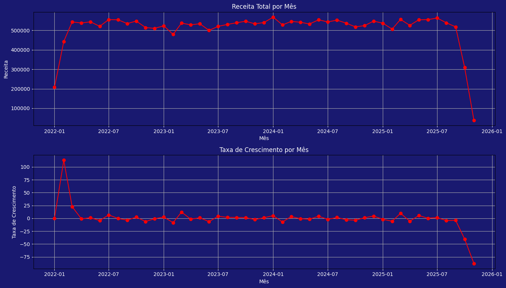
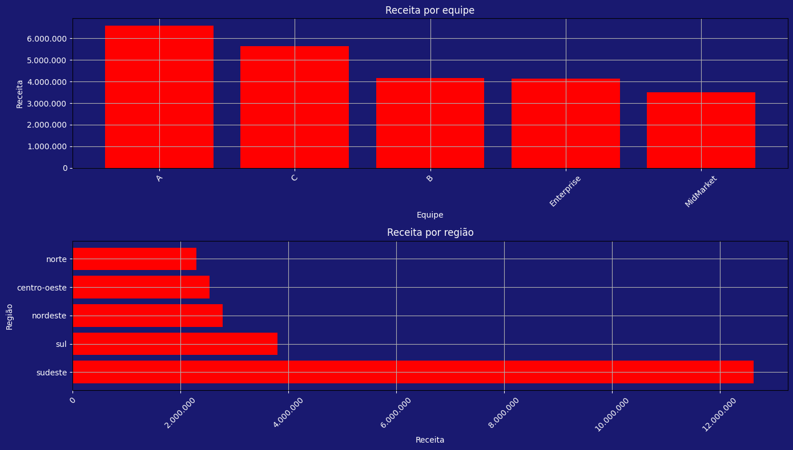
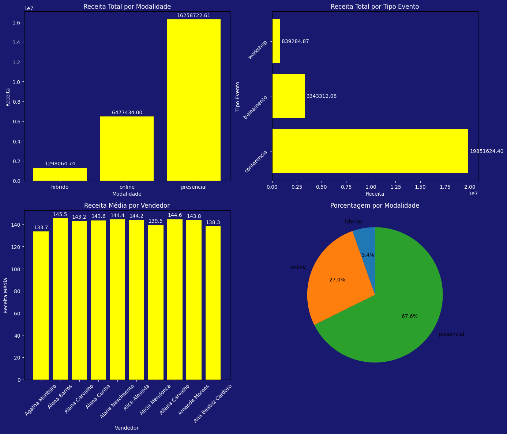

  

<em>Painel de receita, ticket médio e performance de equipes</em>

# 📊 Análise Comercial com Python, Pandas e Matplotlib

Este projeto apresenta uma análise exploratória de dados comerciais utilizando **Python**, **Pandas** e **Matplotlib**, com foco em compreender o desempenho de vendas, padrões de receita e comportamento de clientes e equipes.

---

## 🧩 Estrutura do projeto

- `notebooks/` → análises e geração dos gráficos  
- `dados/` → arquivos CSV utilizados na análise  
- `imagens/` → imagens e gráficos exportados  
- `README.md` → documentação do projeto  

---

## 🧠 Objetivo

Explorar e visualizar dados de vendas com base em uma base comercial simulada, identificando tendências, sazonalidade e oportunidades de melhoria no desempenho comercial.

---

## 📈 Principais análises e gráficos

### 1. Receita Mensal e Taxa de Crescimento

  

<em>Visualização da evolução da receita e variação percentual mês a mês.</em>

Análise focada na **evolução da receita confirmada** ao longo do tempo, destacando períodos de pico e queda na performance mensal.

---

### 2. Distribuição de Ticket Médio

  

<em>Comportamento do ticket médio por pedido e por cliente.</em>

Permite identificar o **valor médio das vendas**, entender a dispersão de preços e analisar a consistência do faturamento por cliente.

---

### 3. Receita por Equipe e por Região

  

<em>Comparativo de desempenho entre equipes e regiões de atuação.</em>

Avalia o impacto de cada equipe e região no total de receita, facilitando a análise de produtividade e segmentação de resultados comerciais.

---

### 4. Relação entre Quantidade e Valor Total

  

<em>Relação entre quantidade de itens vendidos e valor total da venda.</em>

Gráfico de dispersão que evidencia correlações entre **volume de vendas e faturamento**, destacando padrões e possíveis outliers.

---

## 🛠️ Tecnologias utilizadas

- Python  
- Pandas  
- Matplotlib  
- Jupyter Notebook  

---

## 🔍 Principais aprendizados

- Manipulação e limpeza de dados com Pandas  
- Criação de gráficos customizados com Matplotlib  
- Uso de métricas comerciais (ticket médio, receita mensal, crescimento percentual)  
- Análise exploratória e comparativa entre dimensões de negócio  

---

## 👤 Autor

**Lucas Borges**  
Estudante de Sistemas de Informação • Foco em Análise de Dados e Desenvolvimento em Python  
[LinkedIn](https://www.linkedin.com/in/lucas-borges21)  
[GitHub](https://github.com/LucasBorges21)

---

<em>Projeto desenvolvido para fins de aprendizado e demonstração de portfólio em Análise de Dados.</em>

